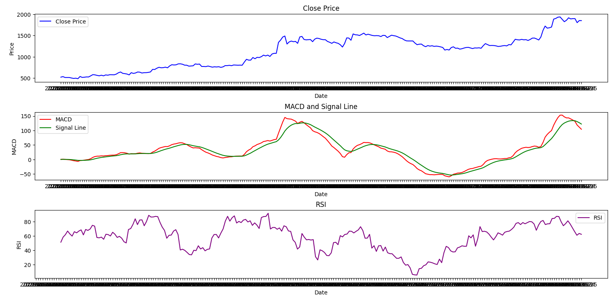

# MACD x RSI Trading Strategy:
  - **Overview:**
    - `MACD (Moving Average Convergence Divergence)` : MACD is a trend-following momentum indicator that shows the relationship between two moving averages of a security’s price. It consists of the MACD line, signal line, and histogram.

    - `RSI (Relative Strength Index)` : RSI is a momentum oscillator that measures the speed and change of price movements. It oscillates between 0 and 100 and is typically used to identify overbought or oversold conditions in a stock.
  - **Parameters:**
    - `Short Window` : The time period used to calculate the short-term Exponential Moving Average (EMA) in the MACD calculation.
    - `Long Window` : The time period used to calculate the long-term EMA in the MACD calculation.
    - `Signal Window` : The time period used to calculate the signal line in the MACD calculation.
    - `RSI Window` : The time period used to calculate the RSI.
  - **Logic:**
    - MACD (Moving Average Convergence Divergence)
		- When to Buy:
			- `Bullish Crossover` : A buy signal is generated when the MACD line crosses above the signal line. This indicates increasing bullish momentum and is a potential entry point for long positions.
			- `Positive Divergence`: If the asset price makes a new low while the MACD histogram forms a higher low, it suggests that the downward momentum is weakening, which can be interpreted as a bullish signal.
		- When to Sell:
			- `Bearish Crossover`: A sell signal occurs when the MACD line crosses below the signal line. This indicates increasing bearish momentum and is considered a potential exit point for long positions.
			- `Negative Divergence`: If the asset price makes a new high while the MACD histogram forms a lower high, it suggests that the upward momentum is weakening, which can be interpreted as a bearish signal.

    - RSI (Relative Strength Index)
		- When to Buy:
			- `Oversold Condition` : RSI readings below 30 typically indicate that a stock is oversold. A buy signal is generated when the RSI crosses above 30 after being in the oversold region, suggesting that the downward pressure may be easing and a potential reversal to the upside may occur.
		- When to Sell:
			- `Overbought Condition` : RSI readings above 70 generally indicate an overbought stock. A sell signal is generated when the RSI 	crosses below 70 after being in the overbought region, suggesting that the upward momentum may be slowing down and a potential reversal to the downside may occur.
  - **Code:**
    
    - [macd.py](macd.py): Python script containing the strategy code.
      
  - **Usage:**
    
    - Make sure you have installed the required Python libraries, You can install them using pip if you haven't already:
      ```bash
 		pip install pandas numpy matplotlib 
      
    - Replace 'stock_data.csv' with the path to your actual data file. Ensure that your data file contains at least two columns: 'Date' and 'Close'.
		```bash
  		df = pd.read_csv('stock_data.csv')

    - Adjust the parameters (optional): You can adjust the parameters for the MACD and RSI calculations namely the short window, long window, signal window for MACD, and the window for RSI.

    - Customize the plotting (optional): You can customize the plotting code to suit your preferences. This includes changing colors, adding titles, adjusting the figure size, etc.

  - **Example Visualization:**
    - 
  - **Backtesting:**
    - Refer to the [backtesting/](backtesting/) directory for scripts evaluating the performance of this strategy.
  - **Results:**
    - Visualizations and performance metrics for this strategy can be found in the `results/` directory.
