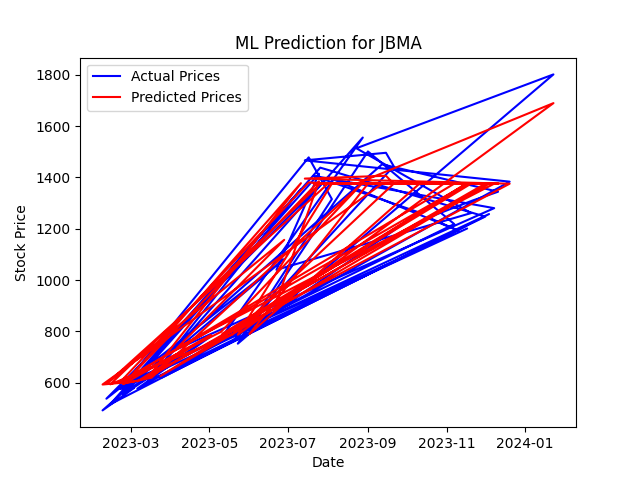

# Stock Price Prediction using Random Forest Regressor

  - **Overview:**
    - This Python script utilizes a Random Forest Regressor to predict stock prices based on historical data. The script also includes data preprocessing, feature engineering, model training, evaluation, and visualization steps.
  - **Features:**

    - The script performs the following steps:

 		- ` Data Pre-Processing `: Converts the 'Date' column to datetime format and sets it as the index.

		- ` Feature Engineering `: Adds a simple moving average (SMA) with a window of 20 days.

		- ` Train-Test Split `: Splits the data into training and testing sets.

		- ` Model Training `: Utilizes a Random Forest Regressor with 100 estimators.

		- ` Model Evaluation `: Calculates the Mean Absolute Error (MAE) on the testing set.

		- ` Visualization `: Plots the actual and predicted stock prices.

  - **Parameters:**
    - `n_estimators`: The number of trees in the forest. In this script, it's set to 100.
    - `random_state`: Controls the randomness of the estimator. It's set to 42 for reproducibility.
  - **Logic:**
    - `Buy Signal`: A buy signal could be generated when the predicted stock price is expected to rise significantly compared to the current price. 
		-This might be inferred when the predicted price is consistently higher than the actual price.
    - `Sell Signal`: Conversely, a sell signal could be triggered when the predicted stock price is expected to drop significantly compared to the current price. 
		-This might be indicated when the predicted price consistently falls below the actual price.
  - **Code:**
    - [`ML_script.py`](ML_script.py): Python script containing the strategy code.
  - **Usage:**
    - To use this strategy, follow the instructions in the README and execute the provided Python script.
    - Adjust parameters as needed to suit your trading preferences.
  - **Example Visualization:**
    - 
  - **Backtesting:**
    - Refer to the `backtesting/` directory for scripts evaluating the performance of this strategy.
  - **Results:**
    - The model's Mean Absolute Error (MAE) on the testing set is printed to the console. Additionally, a plot comparing actual and predicted stock prices is generated.

