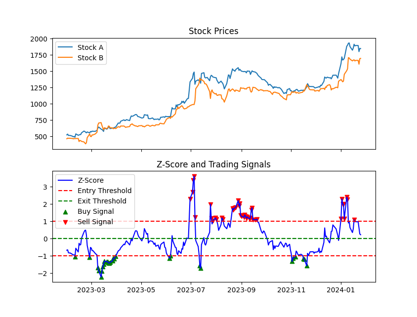

# Pair Trading Strategy using Z-Score:
  - **Overview:**
    - This Python script utilizes pairs trading strategy to identify potential trading opportunities between two stocks. Pairs trading involves identifying two stocks whose prices historically move together and then taking advantage of temporary divergences from their typical relationship.
  - **Parameters:**
    - `entry_threshold`: The z-score threshold at which trading positions are initiated. When the z-score crosses this threshold positively or negatively, it indicates a potential entry point for trading.

    - `exit_threshold` : The z-score threshold at which trading positions are exited. When the z-score crosses this threshold, it indicates a potential exit point for trading.
  - **Logic:**
    - Load historical stock data from CSV files for two stocks (Stock A and Stock B).
    - Calculate the spread between Stock A and Stock B by taking the difference in their closing prices.
    - Compute the z-score of the spread to measure its deviation from the mean in terms of standard deviations.
    - Based on the defined entry and exit thresholds, generate trading signals:
     	- If the z-score is above the entry threshold, initiate a short position on Stock A and a long position on Stock B.
     	- If the z-score is below the negative entry threshold, initiate a long position on Stock A and a short position on Stock B.
     	- Exit the positions when the z-score crosses the exit thresholds (positive or negative).

  - **Code:**
    - [pt.py](pt.py): Python script containing the strategy code.
  - **Usage:**
    - Ensure you have the necessary libraries installed: pandas, numpy, matplotlib, statsmodels.
    - Prepare CSV files containing historical stock data for Stock A and Stock B.
    - Modify the entry_threshold and exit_threshold parameters as needed.
    - Run the script, providing the correct paths to the CSV files for Stock A and Stock B.
    - Analyze the plotted stock prices, z-score, and trading signals to make trading decisions.
  - **Example Visualization:**
    - 
  - **Backtesting:**
    - Refer to the [backtesting/](backtesting/SMA) directory for scripts evaluating the performance of this strategy.
  - **Results:**
    - Visualizations and performance metrics for this strategy can be found in the `results/` directory.
